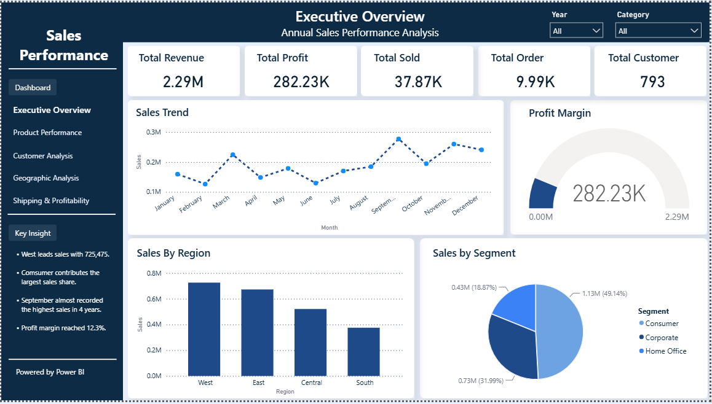

# Superstore
Superstore sales analysis

Project Overview

This project presents an end-to-end data analysis of the Superstore dataset, focusing on sales performance, profitability, products, customers, geographic regions, and shipping methods.

The analysis was conducted to identify business performance patterns, evaluate key areas contributing to sales and profitability, and generate data-driven recommendations that can support business decision-making.

The project covers the complete data analysis workflow, beginning with data preparation and validation, followed by data modeling and dashboard development, and concluding with business insights and recommendations.

## Dataset Information

| Information    | Description                                                  |
| -------------- | ------------------------------------------------------------ |
| Dataset        | Superstore                                                   |
| Source         | Kaggle                                                       |
| Data Period    | 2014–2018                                                    |
| Tools          | Excel, MySQL, Power BI                                       |
| Analysis Focus | Sales, Profitability, Products, Customers, Regions, Shipping |

The dataset contains transactional information that enables analysis of business performance across different products, customer segments, geographic areas, and shipping methods.

## Business Objectives

The primary objectives of this project are:

1. Evaluate overall sales and profitability performance.
2. Identify products with high and low sales performance.
3. Evaluate product profitability and identify products with low or negative profit.
4. Analyze sales and profitability across customer segments.
5. Identify high-value customers and their contribution to total sales.
6. Analyze sales and profitability across geographic regions.
7. Evaluate the relationship between shipping methods, sales, shipping costs, and profitability.
8. Develop data-driven recommendations based on the analysis results.

These objectives are designed to provide a comprehensive view of business performance and identify areas that require further attention.

## Data Preparation and Cleaning

The initial stage of the project focused on preparing the raw dataset for analysis.

The data quality review identified several issues, including:

* Duplicate records
* Incorrect data types
* Inconsistent values
* Formatting issues

The cleaning process consisted of data profiling, data validation, data type correction, value standardization, and preparation of the final cleaned dataset.

Excel and MySQL were used during this stage to support data cleaning, preparation, querying, and validation.

## Data Modeling

Following the data cleaning process, the cleaned dataset was prepared in Power BI to create a structured analytical model.

The data model was used as the foundation for developing analytical measures and visualizations required for dashboard development.

DAX was utilized to develop KPIs and measures used in the analytical dashboard.

## Dashboard Analysis

The Power BI dashboard consists of several analytical perspectives covering executive performance, product performance, customer analysis, geographic performance, and shipping profitability.

### 1. Executive Overview

The Executive Overview provides a high-level assessment of sales, profit, orders, and customer performance.

Key findings include:

* The West region recorded the highest sales at approximately 725,475.
* The Consumer segment contributed the largest share of sales.
* September recorded sales close to the highest monthly sales level during the four-year period.
* Overall profit margin reached 12.3%.

These findings provide an initial overview of the organization's sales and profitability performance.

### 2. Product Performance Analysis

The product performance analysis evaluates sales and profitability at the product and category levels.

Key findings include:

* Cisco TelePresence System EX90 Videoconferencing Unit recorded the highest sales at approximately 22,638.
* 3M Polarizing Light Filter Sleeves generated the highest profit.
* Office Supplies represented the dominant category in terms of overall sales.
* OIC #2 Pencils Medium Soft showed low or negative profitability.

The findings indicate that sales volume alone cannot be used as the primary indicator of product performance. Profitability should also be considered when evaluating products.

### 3. Customer Analysis

The customer analysis focuses on customer value, sales contribution, and performance across customer segments.

Key findings include:

* Sean Miller was identified as the highest-value customer.
* The top 10 customers contributed 6.67% of total sales.
* The Home Office segment generated the lowest profit.

These findings indicate the importance of monitoring customer contribution and developing appropriate strategies for retaining high-value customers.

### 4. Geographic Analysis

The geographic analysis evaluates sales and profitability across regions and states.

Key findings include:

* The West region recorded the highest sales at approximately 725,475.
* The South region recorded the lowest sales.
* The West region contributed approximately 31.6% of total sales.
* New York generated the highest profit.

The results indicate differences in performance between geographic areas and provide a basis for identifying regions with strong performance as well as regions requiring improvement.

### 5. Shipping and Profitability Analysis

The shipping analysis evaluates shipping methods in relation to sales, shipping costs, and profitability.

Key findings include:

* Standard Class generated the highest sales.
* Customer had the highest shipping cost.
* Quarter 4 generated the highest profit.

The analysis highlights the importance of evaluating shipping methods not only from a sales perspective but also from the perspective of operational costs and profitability.

## Business Recommendations

Based on the findings from the analysis, several recommendations were identified.

### Strengthen High-Performing Regions

The West region should be maintained as a strong-performing market while further strategies should be considered to improve the performance of lower-performing regions.

### Optimize Product Profitability

Products with high profitability should be prioritized, while products with low or negative profitability should be reviewed to identify opportunities for improving overall profitability.

### Focus on High-Value Customers

Targeted strategies can be developed for high-value customers to improve customer retention and increase their contribution to total sales.

### Improve Shipping Efficiency

Shipping methods associated with high costs or lower profitability should be evaluated to identify opportunities for improving operational efficiency.

## Skills and Tools

### Excel

Used for data cleaning and initial data preparation.

### MySQL

Used for data querying, validation, and supporting the data preparation process.

### Power BI

Used for data modeling, visualization, interactive dashboard development, and business performance analysis.

### DAX

Used to develop KPIs and analytical measures for the Power BI dashboard.

### Data Analysis

Applied to identify trends, performance patterns, and relationships within the dataset.

### Business Analysis

Applied to translate analytical findings into business insights and recommendations.

## Project Outcome

This project demonstrates the ability to transform raw transactional data into structured information and actionable business insights.

The analysis covers the complete data analytics workflow, from data preparation and validation to data modeling, dashboard development, performance analysis, and business recommendations.

The project demonstrates the practical application of Excel, MySQL, Power BI, and DAX in supporting data-driven business analysis.

## Conclusion

The Sales Superstore project demonstrates an end-to-end approach to data analysis using Excel, MySQL, Power BI, and DAX.

The project combines technical data preparation and analytical skills with business-oriented interpretation. Through the analysis of sales, profitability, products, customers, geographic regions, and shipping methods, the project identifies key performance patterns and translates them into recommendations that can support business decision-making.

This project represents the practical application of data analytics skills in transforming raw data into meaningful and actionable business insights.

## Author

**Nazar Indra Pratama**

Aspiring Data Analyst

**Technical Skills:** Excel, MySQL, Power BI, DAX, Data Cleaning, Data Visualization, Data Analysis, Business Analysis

**Portfolio Project:** Sales Superstore Data Analysis
**Date:** August 2026
